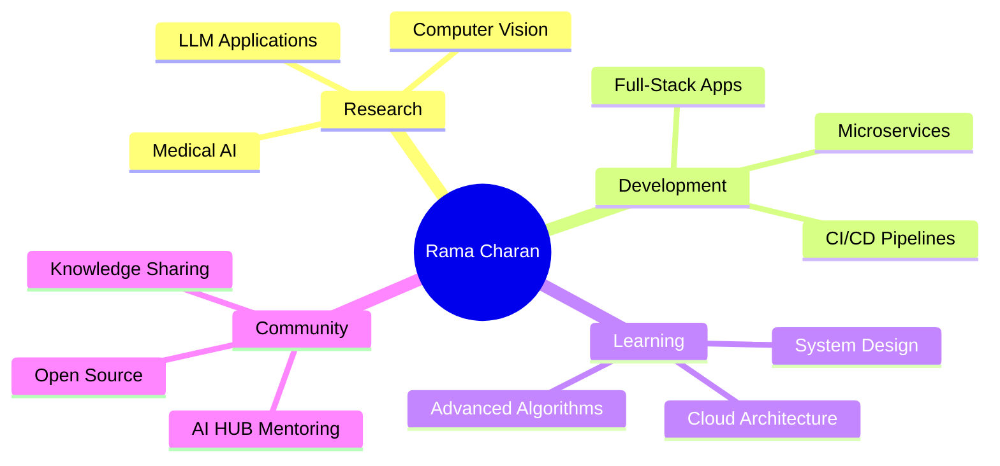

# 👋 Hi, I'm Harsha Vardhan Reddy Emani

<div align="center">
  
</div>

<div align="center">
  
[](https://www.linkedin.com/harsha-vardhan-reddy-emani-0a61701b8/)
[](https://leetcode.com/u/Eharsha4261/)
[](mailto:ehvrreddy456@gmail.com)
[](#)

</div>

---

## 🚀 About Me

I'm a passionate **Full-Stack AI Developer** and 3rd B.Tech AI/ML student who transforms ideas into production-ready solutions.

```python
class HarshaVardhan:
    def __init__(self):
        self.role = "Full-Stack AI Developer"
        self.location = "Guntur, Andhra Pradesh, India"
        self.education = "B.Tech AI/ML (CGPA: 8.59/10)"
        self.experience = {
            "research_intern": "CAD-Intern",
            "projects": "Promt prompt classification, web scrapping",
        }
```

---

## 🛠️ Tech Arsenal

<div align="center">

### 💻 Programming Languages


<!--  -->


### 🤖 AI/ML & Data Science

<!-- 

 -->


### 🌐 Web Development
<!--


 -->

### ☁️ Cloud & DevOps
<!--
 -->


### 🗄️ Databases


<!--
 -->

</div>

---

<!--## 🏆 Achievements & Certifications

<div align="center">

<table>
<tr>
<td align="center" width="50%">

### 🏅 Competition Wins
**🥇 Code Spark 2024** - 1st Place  
*HackerEarth Platform*

**🥇 Data Hunt Hackathon 2023** - 1st Place  
*75K+ Airport Records Analysis*

**🎯 LeetCode** - 100+ Problems Solved  
*Active Problem Solver*

</td>
<td align="center" width="50%">

### 📜 Certifications
**☁️ AWS Certified AI Practitioner**  
*Cloud AI Services & Architecture*

**🎨 UI/UX Design Certification**  
*GUVI - Design Thinking & Figma*

**🐍 NPTEL Data Science using Python**  
*Comprehensive Python & ML*

</td>
</tr>
</table>

</div>

---

## 🔥 Featured Projects

<div align="center">

### 🤖 Smart AI-Powered ATS Platform
*Production-grade recruitment system serving 100+ users*

[](link)
[](link)
[](link)
[](link)

**Key Achievements:**
- ⚡ **60% reduction** in resume screening time
- 📊 **95%+ parsing accuracy** for resume analysis
- 🔒 **JWT authentication** with role-based access
- 🐳 **Dockerized deployment** on AWS infrastructure
- 📈 **<200ms response time** under load

---

### 🔍 Medical AI: Skin Lesion Classification
*Advanced CNN research achieving clinical-grade accuracy*

[](link)
[](link)
[](link)

**Research Impact:**
- 🎯 **98.65% sensitivity** on HAM10000 dataset
- 🧠 **ConvNeXt + ViT+CBAM** hybrid architecture
- 🔬 **Multi-modal pipeline** with dermoscopic features
- 📚 **Published on Hugging Face** for research community

---

### ⚡ LogFast: High-Performance Log Analyzer
*C++17 system processing millions of logs efficiently*

[](link)
[](link)

**Performance Features:**
- 🚀 **Custom thread pool** architecture
- 🔒 **Lock-free operations** for high throughput
- 💾 **Memory-efficient** processing
- ⚙️ **Optimized regex** parsing

---

### 🗣️ Telugu Text-to-Speech System
*Making AI speak regional languages*

[](link)
[](link)

**Language Processing:**
- 🎵 **8,576 audio samples** training dataset
- 🔤 **Custom transliteration** pipeline
- 📱 **116+ downloads** on Hugging Face
- 🌏 **Regional language support** for Telugu

</div>
-->
---


## 📊 GitHub Analytics

<div align="center">


</div>

<div align="center">

</div>

### 📈 Contribution Activity
<div align="center">

</div>

---
<!--
## 🎯 Current Focus Areas

<div align="center">



</div>

**🔬 Research**: Advancing medical AI with hybrid CNN architectures  
**💻 Development**: Building scalable, production-ready applications  
**📚 Learning**: System design, cloud architecture, and LLM optimization  
**👥 Community**: Mentoring 50+ students through AI HUB initiatives

---

## 🌟 Professional Journey

<div align="center">

| Timeline | Role | Organization | Achievement |
|----------|------|--------------|-------------|
| **2025 - Present** | Research Intern | IIIT Nagpur | 98.65% medical AI accuracy |
| **2025 - Present** | AI Mentor | AI HUB | 50+ students mentored |
| **2024** | Competition Winner | HackerEarth | Code Spark 1st Place |
| **2023** | Hackathon Winner | Data Hunt | 75K records analysis |
| **2022 - 2026** | B.Tech Student | VVIT | CGPA: 8.48/10 |

</div>

---
-->
## 🎨 Fun Facts & Interests

<div align="center">

<!--🎯 **Problem Solving**: 100+ LeetCode problems conquered   -->
☕ **Fuel**: Converting coffee into production-ready code since 2022  
🌍 **Languages**: English (Fluent), Telugu (Native), Hindi (Conversational)  
🎮 **Philosophy**: *"Code should be written for humans to read"*  
🚀 **Goal**: Building AI systems that make a real-world impact  

</div>

---

## 📞 Let's Connect!

<div align="center">

I'm always excited to discuss:
- 🤖 AI/ML system architecture and optimization
- 🌐 Full-stack development and scalable systems
- 🔬 Research collaboration in computer vision
- 💼 Production deployment strategies and DevOps

**📧 Email**: ehvrreddy456@gmai.com  
**⚡ Response Time**: Usually within 24 hours  
**🌍 Location**: Guntur, Andhra Pradesh, India  
**💼 Status**: Open to opportunities and collaborations

---

<div align="center">

</div>

<div align="center">
<i>⭐ "Building the future, one well-tested commit at a time." ⭐</i>
</div>

</div>
